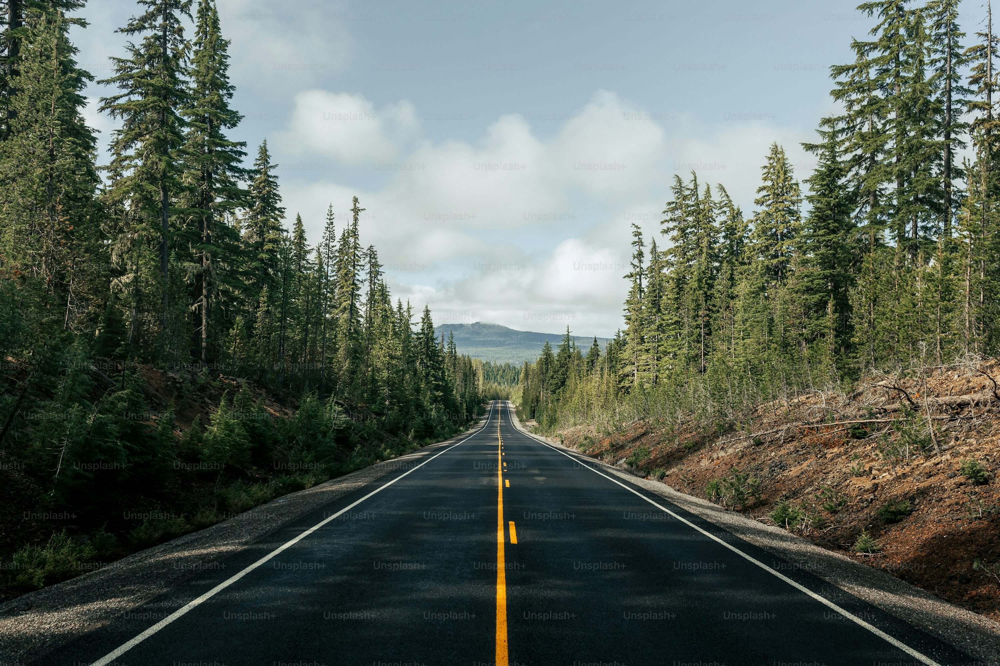
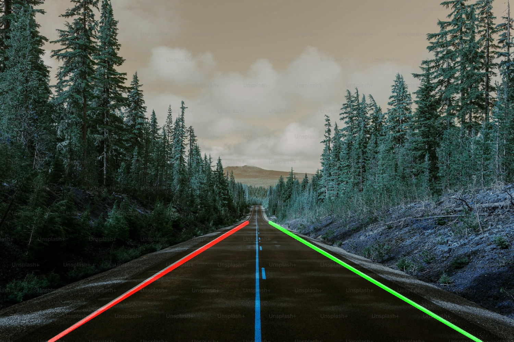

# 🚦 **LaneLineDetection**

### 📝 **Description**

AI-powered **computer vision** system for **autonomous driving**. Uses **image
processing**, **edge detection**, and **lane detection** to enhance **road
safety**. Built with **Python, OpenCV, and NumPy**.

### ✨ **Features**

✅ **Lane Detection** 🛣️ using Hough Transform  
✅ **Edge Detection** 📏 with Canny algorithm  
✅ **Image Processing** 🎨 (Blurring, Thresholding, ROI masking)  
✅ **Optimized Pipeline** ⚡ for real-time processing  
✅ **Modular & Scalable** 🛠️ architecture

### 🛠️ **Tech Stack**

🔹 **Programming**: Python 🐍  
🔹 **Libraries**: OpenCV 📷, NumPy 🔢, Matplotlib 📊  
🔹 **Concepts**: Computer Vision 👁️, Image Processing
🎞️  <!-- Machine Learning 🤖 -->

### 🚀 **Installation**

```bash
git clone https://github.com/gvelasque/lane_detection.git
cd LaneLineDetection
pip install -r requirements.txt
```

### ▶️ **Usage**

```python
python
main.py
```

### 🎯 **Example**
#### 📥 Input Image | 📤 Output Image
<p align="center">
    
    
</p>
